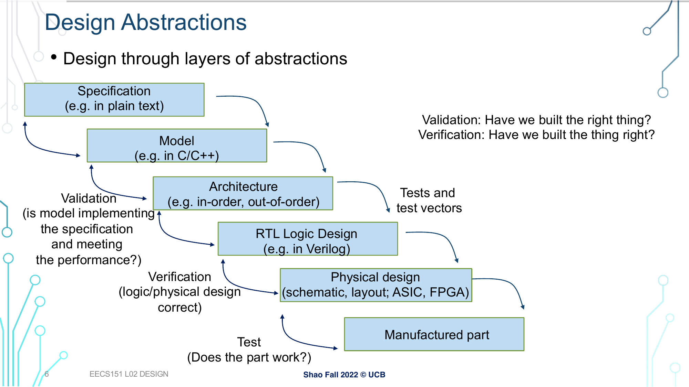
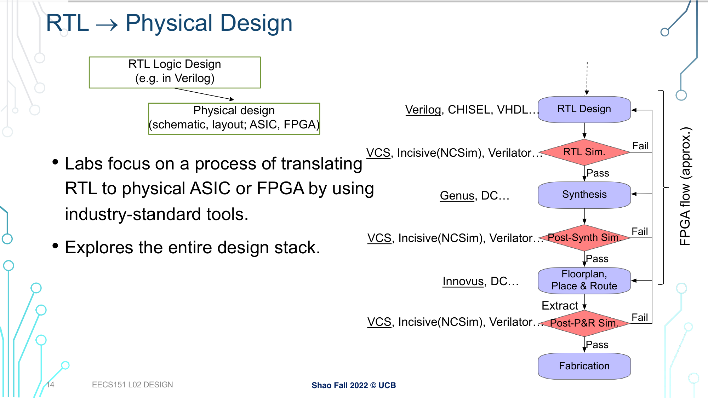

# Digital electronics fall 2024 ASIC labs (asic-labs-fa24)

Welcome to the repository for Digital electronics fall 2024 ASIC labs! This repository will contain all the information you need to complete lab exercises. If you are just getting started, read through the [Introduction](#introduction) and make sure to see the [Setup](#setup) section to create your environment.


## Table of contents
- [Digital electronics fall 2024 ASIC labs (asic-labs-fa24)](#asic-labs-fa24)
    - [Table of contents](#table-of-contents)
    - [Lab Due Dates](#lab-due-dates)
    - [Introduction](#introduction)
        - [CAD Tools](#cad-tools)
        - [Process Design Kit](#process-design-kit)
        - [Hammer](#hammer)
    - [Setup](#setup)
        - [GitHub Account and Repo](#github-account-and-repo)
        - [Hammer Setup](#hammer-setup)
        - [Install Anaconda](#install-anaconda)
        - [Open-source Tools and Technology Setup](#open-source-tools-and-technology-setup)
        - [Questa Sim Setup](#questa-sim-setup)
            - [Questa Sim License Renewal](#questa-sim-license-renewal)
    - [Conclusion](#conclusion)
    - [Acknowledgement](#acknowledgement)


## Lab Due Dates

All labs must be checked off **before** your next lab session.

| Lab |    Start Date     |    Due Date     |
|:---:|:-----------------:|:---------------:|
|  1  |  not after 10/25  | 11/04 (11:59pm) |
|  2  |  not after 11/05  | 11/18 (11:59pm) |
|  3  |  not after 11/19  | 12/02 (11:59pm) |
|  4  |  not after 12/03  | 12/22 (11:59pm) |
|  5  |  not after 12/23  | 12/31 (11:59pm) |


## Introduction

The topic of these lab exercises is the digital [ASIC](https://en.wikipedia.org/wiki/Application-specific_integrated_circuit) design, and their purpose is to teach an introduction to chip design, from theory to practice.

The high-level digital design flow chart is shown below.

<!-- Design flow slide -->
<figure align="center">
  
  <figcaption>Image borrowed from: https://www2.eecs.berkeley.edu/Courses/EECS151
</figure>

Here is a more detailed physical design flow chart.

<!-- ASIC design flow slide -->
<figure align="center">
  
  <figcaption>Image borrowed from: https://www2.eecs.berkeley.edu/Courses/EECS151
</figure>

This flow chart shows many of the individual stages digital designers follow in industry. However, it does not show the cyclical nature between individual stages. For example, a bug discovered in *Post-P&R Sim* can provoke *RTL Design* modifications. In general, problems discovered in the **backend** (flow steps after *Synthesis*) sometimes require changes in the **frontend** (flow steps up to *Synthesis*). Therefore, it is imperative that you are well-versed in the mechanics of simulating your designs before even designing anything! For now, the principal stages to pay attention to are: *RTL Design*, *Synthesis*, *Place and Route*. The lab exercises will cover the details of each flow step.


### CAD Tools

Going through the design flow is quite labor-intensive and intricate. In general, computer-aided design (CAD) software tools refer to programs used to reduce the burden of manually performing each stage of a design flow. Electronic design automation (EDA), or electronic computer-aided design (ECAD), tools are specifically created to aid in integrated circuit design flows.

The three major CAD companies for ASIC design are *Cadence*, *Synopsys* and *Siemens*. Each of these companies supplies tools for all stages of the Very Large-Scale Integration (VLSI) flow (VLSI refers to complex ICs with thousands or more transistors). Also, over the last few years, open-source EDA tools are also being developed, and they are becoming more and more powerful and can be utilized to create functional chips.

Commonly used EDA tools currently available for ASIC design can be found in the table below.

<!-- <style type="text/css">
.tg  {border-collapse:collapse;border-spacing:0;}
.tg td{border-color:black;border-style:solid;border-width:1px;font-family:Arial, sans-serif;font-size:14px;
  overflow:hidden;padding:10px 5px;word-break:normal;}
.tg th{border-color:black;border-style:solid;border-width:1px;font-family:Arial, sans-serif;font-size:14px;
  font-weight:normal;overflow:hidden;padding:10px 5px;word-break:normal;}
.tg .tg-c3ow{border-color:inherit;text-align:center;vertical-align:top}
</style> -->
<table class="tg", align="center">
<thead>
  <tr>
    <th class="tg-c3ow"><b>Vendor</b></th>
    <th class="tg-c3ow">Synopsys</th>
    <th class="tg-c3ow">Cadence</th>
    <th class="tg-c3ow">Siemens</th>
    <th class="tg-c3ow">Open-source</th>
  </tr>
</thead>
<tbody>
  <tr>
    <td class="tg-c3ow"><b>Simulation</b></td>
    <td class="tg-c3ow"><em>VCS</em></td>
    <td class="tg-c3ow"><em>Xcelium Logic Simulator</em></td>
    <td class="tg-c3ow"><em>Model Sim/Questa Sim</em></td>
    <td class="tg-c3ow"><em>Verilator/Icarus</em></td>
  </tr>
  <tr>
    <td class="tg-c3ow"><b>Synthesis</b></td>
    <td class="tg-c3ow"><em>Fusion Compiler (Design Complier)</em></td>
    <td class="tg-c3ow"><em>Genus</em></td>
    <td class="tg-c3ow"><em>-</em></td>
    <td class="tg-c3ow"><em>Yosys</td>
  </tr>
  <tr>
    <td class="tg-c3ow"><b>Place and Route</b></td>
    <td class="tg-c3ow"><em>Fusio nCompiler (IC Compiler II)</em></td>
    <td class="tg-c3ow"><em>Innovus</em></td>
    <td class="tg-c3ow"><em>-</em></td>
        <td class="tg-c3ow"><em>OpenROAD</td>
  </tr>
  <tr>
    <td class="tg-c3ow"><b>Physical Layout</b></td>
    <td class="tg-c3ow"><em>Custom Compiler</em></td>
    <td class="tg-c3ow"><em>Virtuoso Layout Suite</em></td>
    <td class="tg-c3ow"><em>L-Edit</em></td>
    <td class="tg-c3ow"><em>Magic/Klayout</em></td>
  </tr>
  <tr>
    <td class="tg-c3ow"><b>DRC and LVS</b></td>
    <td class="tg-c3ow"><em>IC Validator</em></td>
    <td class="tg-c3ow"><em>Virtuoso Layout Suite</em></td>
    <td class="tg-c3ow"><em>Calibre</em></td>
    <td class="tg-c3ow"><em>Magic/Klayout,Netgen</em></td>
  </tr>
  <tr>
    <td class="tg-c3ow"><b>Verification and Signoff</b></td>
    <td class="tg-c3ow"><em>NanoTime</em></td>
    <td class="tg-c3ow"><em>Virtuoso Layout Suite</em></td>
    <td class="tg-c3ow"><em>Calibre</em></td>
    <td class="tg-c3ow"><em>Magic/Klayout</em></td>
  </tr>
  <tr>
    <td class="tg-c3ow"><b>Power</b></td>
    <td class="tg-c3ow"><em>Prime Power</em></td>
    <td class="tg-c3ow"><em>Voltus</em></td>
    <td class="tg-c3ow"><em>-</em></td>
    <td class="tg-c3ow"><em>-</em></td>
  </tr>
</tbody>
</table>

It is common to utilize different tools for different stages of the design flow. This is possible because the tools typically write out common interchange file formats that can be consumed by other vendors' tools, or they provide utilities such that files can be converted to different formats. For example, a design may use Synopsys *VCS* for simulation, Cadence *Genus* and *Innovus* for synthesis and place and route, respectively, and Mentor *Calibre* for DRC and LVS.

However, these tools are proprietary, and the licenses for their usage can be quite expensive. The leading open-source alternative, the foundational application for semiconductor digital design, is the [OpenROAD](https://theopenroadproject.org/) project. Its goal is *"24-hour, No-Human-In-The-Loop layout design for SOC with no Power-Performance-Area (PPA) loss Tapeout-capable tools in source code form, with permissive licensing"*. It contains a set of tools capable of rapid design exploration and physical design implementation, covering most of the ASIC design flow.


### Process Design Kit

"*A PDK is a set of files used within the semiconductor industry to model a fabrication process for the design tools used to design an integrated circuit. PDK's are often specific to a foundry and may be subject to a non-disclosure agreement. While most PDK's are proprietary to a foundry, certain PDKs are open-source and entirely within the public domain.*" (definition borrowed from [here](https://blink.ucsd.edu/sponsor/exportcontrol/pdkguidance.html)).

In this course we will use [SkyWater SKY130](https://skywater-pdk.readthedocs.io/en/main/), or SKY130, which is an open source process design kit (PDK) for a 130nm node. This is the PDK we will use for this lab. Right now, the details of the PDK are unnecessary, as you will gain familiarity in future labs. All major companies like Intel, Samsung, Global Foundries, or TSMC have their own PDKs.


### Hammer

In this course, we will use an ASIC design framework developed at Berkeley called Hammer. Hammer abstracts tool- (Cadence, Synopsys, Mentor, etc.) and technology- (TSMC, X-FAB, Intel, etc.) specific considerations away from ASIC design. The philosophy of Hammer aims to maximize reusability of design intent between projects that may have different underlying tool infrastructures and target different process technologies. Documentation about Hammer philosophy and usage is at Hammer [website](hammer-vlsi.readthedocs.io).

Hammer consumes serialized configuration files in YAML or JSON format, which are used as intermediate representation (IR) languages between higher-level physical design generators and the underlying scripts that the ASIC design flow tools require.

> **Note:** The version of Hammer that should be used in this course may deviate from the public or "main" Hammer. After completing the course, reference the public [repository](https://github.com/ucb-bar/hammer) if you are interested in the latest, consistent source.


## Setup

This section covers lab environment setup and installation. It goes without saying that a Linux machine is mandatory for these labs, since this is a requirement for all ASIC design CAD tools. Non-tested alternatives on Windows include [WSL](https://en.wikipedia.org/wiki/Windows_Subsystem_for_Linux) or using a hypervisor or virtualizer to run a Linux virtual machine on Linux. The lab content and tools were tested on a Kubuntu 24.04 machine.

> **Note:** In case of any problems, you are encouraged to open a GitHub [issue](https://github.com/elektrotehnika/digel-asic-labs-fa24/issues) or inform your teaching assistant via email (deki@uni.kg.ac.rs).


### GitHub Account and Repo

In this course, we use GitHub to manage labs and the project, so in order to download lab content and submit your results, you are required to create a GitHub account. The instructions on how to do so can be found [here](https://docs.github.com/en/get-started/start-your-journey/creating-an-account-on-github).

This repository should be cloned along with its parent module, using the following commands:

```shell
git clone git@github.com:elektrotehnika/digel.git --recursive
cd digel
git submodule update --recursive --remote --merge
```

and updated using the following commands:

```shell
git pull
git submodule update --recursive --remote --merge
```

Furthermore, in order to be able to do your work and submit lab results, you are required to create a private fork of the lab GitHub repo. First, [create](https://docs.github.com/en/repositories/creating-and-managing-repositories/creating-a-new-repository) a new **private** (not public!) repository using your Github account and name it *digel-asic-labs-fa24*. Continue by following these commands:

```shell
# Create a bare clone of the repository. (This is temporary and will be removed so just do it wherever.)
git clone --bare git@github.com:elektrotehnika/digel-asic-labs-fa24.git
cd digel-asic-labs-fa24.git
# Mirror-push your bare clone to your new easytrace repository.
git push --mirror git@github.com:<your_username>/digel-asic-labs-fa24.git
# Remove the temporary local repository you created in step 1.
cd ..
rm -rf digel-asic-labs-fa24.git
# Clone your digel-asic-labs-fa24 repository to your <lab_work_folder> where you plan to work
cd <lab_work_folder>
git clone git@github.com:<your_username>/digel-asic-labs-fa24.git
# Add the original repo as remote to fetch (potential) future changes.
# Also make sure you also disable push on the remote.
git remote add upstream git@github.com:elektrotehnika/digel-asic-labs-fa24.git
git remote set-url --push upstream DISABLE
# List your remotes
git remote -v
```

Whenever you want to push, do so on `origin` with `git push origin`.
When you want to pull changes from `upstream` you can just fetch the remote and rebase on top of your work. The following commands sync your fork with the original repo:

```shell
git fetch upstream
git rebase upstream/main
git push # if you wish to push upstream changes to your repo
```

It might be a good idea to periodically check if there are any changes to the upstream repo.

When you finish your GitHub repo setup, please add the GitHub account of your [teaching assistant](https://github.com/baywatcher) as a [collaborator](https://docs.github.com/en/account-and-profile/setting-up-and-managing-your-personal-account-on-github/managing-access-to-your-personal-repositories/inviting-collaborators-to-a-personal-repository#inviting-a-collaborator-to-a-personal-repository) and fill in the details in this [form](https://forms.gle/7cVckR779WDxLsvh8)!


### Hammer Setup

As already mentioned, the main tool needed for these labs is [Hammer](https://github.com/ucb-bar/hammer), the physical design framework that simplifies interaction with the ASIC design ECAD tools and specific technologies.

> **Note:** It will be assumed in this lab that all the tools and technologies used in this lab are installed in the default path. Otherwise, some scripts might need manual adjustment!

In order to set up Hammer and its prerequisites, follow these steps:

1. Hammer depends on Python 3.9+, so a corresponding [Python](https://www.python.org/downloads/) version must be installed on your computer.

2. First, go to the Hammer repository:

```shell
cd digel/lab/hammer
```

3. Install [poetry](https://python-poetry.org/docs/master/) (a tool for dependency management and packaging in Python) to manage the development virtual environment and dependencies (with the help of the *curl* command or manually from the URL):

```shell
curl -sSL https://install.python-poetry.org | python3 -
```

4. Create a poetry-managed *virtualenv* using the dependencies from `pyproject.toml`:

```shell
# create the virtualenv inside the project folder (in .venv)
poetry config virtualenvs.in-project true
poetry install
```

5. Activate the *virtualenv*. Within the *virtualenv*, Hammer is installed and you can access its scripts defined in `pyproject.toml` (in `[tool.poetry.scripts]`):

```shell
poetry shell
hammer-vlsi -h
```

This virtual environment needs to be activated each time you are about to run Hammer. But for now, let's exit and finish the rest of the setup.


### Install Anaconda

In these labs, we will mainly use open-source ASIC design tools and technologies. For that reason, we will also download the needed technology files and install the required tools using the *conda* (Anaconda) environment.

1. Download the Anaconda installation [script](https://repo.anaconda.com/archive/Anaconda3-2024.06-1-Linux-x86_64.sh)
(from [here]([https://www.anaconda.com/download/success)).

2. Install and setup Anaconda by running the following commands:

```shell
chmod u+x Anaconda3-2024.06-1-Linux-x86_64.sh
bash Anaconda3-2024.06-1-Linux-x86_64.sh
eval "$(~/anaconda3/bin/conda shell.bash hook)"
conda init
```

Total Anaconda installation size is ~7GB.


### Open-source Tools and Technology Setup

The next step of our setup is installing OpenROAD tools using Anaconda and SkyWater SKY130 PDK using the [Open_PDKs](https://github.com/RTimothyEdwards/open_pdks) tool. This is accomplished by running a special script within the Hammer repository:

```shell
cd digel/lab/hammer/
./e2e/scripts/setup-sky130-openroad.sh
```

This step will probably take a long time due to the amount and size of the required installs. Total download installation size is ~42GB.


### Hammer test

We have installed all the prerequisites needed for running a simple synthesis example with Hammer:

```shell
cd hammer
poetry shell
cd e2e
sed -i "s;~;$HOME;g" configs-env/or_sky130-env.yml
make design=pass pdk=sky130 tools=or env=or_sky130 build
make design=pass pdk=sky130 tools=or env=or_sky130 syn
exit # exit the virtual environment
```

If everything is installed and set up correctly, those commands should execute without errors.


### Questa Sim Setup

Last but not least, we are going to install a proprietary, but free, EDA simulator (currently more useful for these education purposes), Questa Sim, by following these steps:

1. Questa Sim can be downloaded from the following [link](https://www.intel.com/content/www/us/en/software-kit/795215/questa-intel-fpgas-standard-edition-software-version-23-1.html).

2. Accept the Software License Agreement, and after downloading the executable, give it executable permissions, and run it. Select *Intel FPGA Starter Edition*, accept the License Agreement, and select the default installation directory. Total installation size is ~4.5GB.

3. Next, register for Intel FPGA Self-Service Licensing Center (SSLC) [here](https://fpgasupport.intel.com/Licensing/license/index.html)
(click *Enroll for Intel FPGA Self Service Licensing Center (SLLC)*)

4. Click on *Create an Account* and enter your details. Verify your email afterwards.

5. Continue the enrollment process by selecting *FPGA Engineering* as *Profession* and clicking *Submit*.

6. Now, go to [SSLC](https://fpgasupport.intel.com/Licensing/license/index.html) again, sign in (click *Already enrolled ? - Sign In here*), and accept the Terms of Use.

7. Set up multi-factor authentication (MFA) by choosing an MFA method (SMS code, phone call, or an authenticator app of your choice).

8. Once successfully signed into the SSLC, click on *Sign up for Evaluation or No-Cost Licenses*, select *Questa*-Intel® FPGA Starter Edition (License: SW-QUESTA)*, and click *Next*

9. Check the required checkboxes and add a new computer.

10. Get your hostname (*hostname* command) and MAC address from one of your network cards (*ip a* command), and fill in as follows:
    - Computer Name: hostname
    - License Type: FIXED
    - Computer Type: NIC ID
    - Primary Computer ID: MAC address (remove the colons (:))

11. Save this information and generate the license (click *Generate*).

12. Download the license file received via email and save it to *~/intelFPGA/license/license.dat*.

13. Add the Questa Sim executable path folder to PATH to make it accessible from the terminal (you can also add this line to *.profile* or *.bashrc* script in your $HOME folder).

    ```shell
    export PATH="$PATH:$HOME/intelFPGA/23.1std/questa_fse/bin"
    ```

14. Point the LM_LICENSE_FILE environment variable to the license file location (best add this command to *~/.bashrc*).

    ```shell
    export LM_LICENSE_FILE="$HOME/intelFPGA/license/license.dat"
    ```

15. Log out and log back in for the changes to take effect, and check if the installation was successful by running *qhsim*. The Questa Sim GUI should open.

For additional information, refer to this [document](https://cdrdv2-public.intel.com/703091/ug-20352-703090-703091.pdf).

#### Questa Sim License Renewal

In order to renew your yearly license when it expires, follow these steps:

1. Go to [Intel FPGA Licensing Center](https://licensing.intel.com/psg/s/).
2. Log in with 2-factor identification.
3. Go to *Licenses -> Licenses With Expired Maintenance*.
4. Find and copy the *License Activation Code* of your expired license.
5. Go to *Licenses -> Find and Generate License by Activation Code*.
6. Paste the *License Activation Code* and click *Search*.
7. Select your previous license and click *Next*.
8. Click *Generate* and wait for the license *.dat* file to be sent to your email.
9. Download the *.dat* file and move it into *~/intelFPGA/license/*.
10. Update the LM_LICENSE_FILE value (probably in ~/.bashrc) according to your new license file name.

<!--Typically, the Ethernet interface is used, named *ethN*, *enoN*, *enpNsM*, etc. In the absence of an Ethernet interface, you can use a WLAN interface as in the example above, typically named *wlanN*, *wlpNsM*, *wlpNsMfK*, etc.-->


## Conclusion

You are now ready to complete the lab exercises!

<!--Other links worth visiting and investigating:
https://www.siliconcompiler.com/
https://openlane2.readthedocs.io/en/latest/
https://mflowgen.readthedocs.io/en/latest/-->


## Acknowledgement

These labs are the result of the long-term work of many EECS151/251 GSIs from UC Berkeley.

For the purposes of this course, they were modified and adapted by:
- Владимир М. Миловановић (Fa2024)
- Дејан Д. Петковић (Fa2024)
