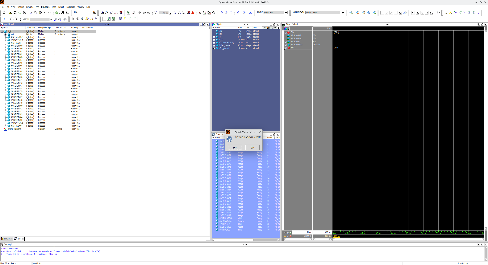
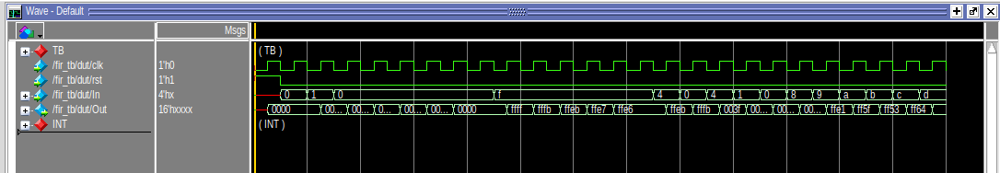
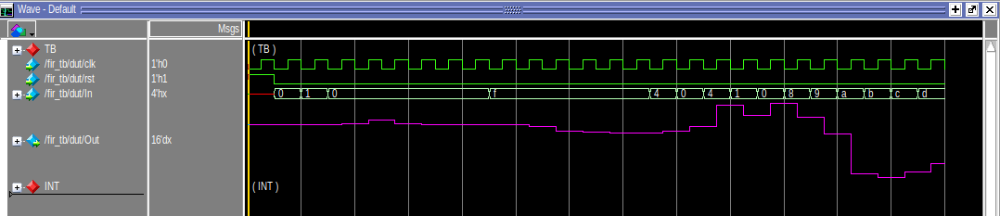

# ASIC Lab 2: Simulation


## Table of Contents
- [ASIC Lab 2: Simulation](#asic-lab-2-simulation)
    - [Table of Contents](#table-of-contents)
    - [Overview](#overview)
    - [Setup](#setup)
    - [Testbenches](#testbenches)
    - [Waveforms](#waveforms)
    - [RTL Simulation](#rtl-simulation)
      - [Simulate the Filter](#simulate-the-filter)
      - [View Waveforms](#view-waveforms)
    - [Gate-level Simulation](#gate-level-simulation)
      - [Compare Behavioral and Gate-level Simulations](#compare-behavioral-and-gate-level-simulations)
      - [Standard Delay Format (SDF)](#standard-delay-format-sdf)
    - [Questions](#questions)`
        - [Question 1: Verilog, Waveforms, and Schematics](#question-1-verilog-waveforms-and-schematics)
        - [Question 2: Understanding Testbenches](#question-2-understanding-testbenches)
        - [Question 3: Writing a Testbench](#question-3-writing-a-testbench)
        - [Question 4: Evaluate Gate-level Simulations](#question-4-evaluate-gate-level-simulations)
        - [Question 5: SDF and Visualization of Setup Time Violations](#question-5-sdf-and-visualization-of-setup-time-violations)
        - [Question 6: Fixing Hold Times](#question-6-fixing-hold-times)
        - [Question 7: Analyzing Power Reports](#question-7-analyzing-power-reports)

## Overview

**Objective:** 
Simulation is a fundamental step in ASIC design and digital design in general. Different forms of simulation can happen at several stages in the design cycle; however, the main two are ***behavioral*** (also called ***RTL simulation***) and ***gate-level***. In this lab, you will be introduced to both using tools developed by [Mentor]https://en.wikipedia.org/wiki/Mentor_Graphics (and later bought by Siemens and Intel, respectively). CAD tools have a steep learning curve. To ease the learning experience, we interact with the CAD tools using Hammer, a tool generated at Berkeley to simplify interaction with the ASIC ECAD tools.

**Topics Covered**
- Verilog Basics
- Behavioral RTL Simulation
- Gate Level Simulation
<!--- - Simple Power Analysis? --->

**Recommended Reading**
- [Verilog Primer](./doc/Verilog_Primer_Slides.pdf)


## Setup

In case you haven't done the main lab [Setup](../README.md#setup) successfully, please do so before you continue in order to be able to follow this lab and submit your results. Also, please remember to regularly update (sync) your lab repo with the latest upstream changes.

Prior to running any commands, you need to activate a Poetry virtual environment with a Hammer (*hammer-vlsi*) installation:

```shell
source ../../hammer/.venv/bin/activate
hammer-vlsi -h
```

Also, prepend your $HOME path to the Hammer configuration variables in `cfg/sky130.yml`:

```shell
sed -i "s;~;$HOME;g" cfg/sky130.yml
```


## Testbenches

A testbench is an HDL module used in simulation only that instantiates the design-under-test (DUT), driving the inputs and verifying outputs. The provided testbench file `fir_tb.v` in the `src/` subdirectory is an example of a simple testbench.

This testbench highlights some critical aspects of creating a testbench. The first is simulating a clock:

```verilog
reg clk;
...
initial clk = 1'b0;
always #(`CLOCK_PERIOD/2) clk <= ~clk;
```

The code above creates a signal named `clk` with `CLOCK_PERIOD` period, which is initially `1'b0`. `CLOCK_PERIOD` is a *define* that is specified in the `sim.inputs.defines` key in `sim-rtl.yml`.

Secondly, most testbenches include an initial block that performs some sequence of operations (typically, driving inputs, checking outputs). Let us look at a snippet:

```verilog
initial begin
  ...
  // Drive input signal several times
  In <= 4'd0;
  @(negedge clk)  In <= 4'd1;
  @(negedge clk)  In <= 4'd0;
  repeat(5) @(negedge clk);
  @(negedge clk)  In <= 4'hF;
  repeat (5) @(negedge clk);
  @(negedge clk)  In <= 4'd4;
  ...
  @(negedge clk)  In <= 4'd14;
  // Finish test
  $display("Test finished.");
  $finish;
end
```

The first thing to notice are the system tasks `$display` and `$finish` (all system tasks begin with `$`):

- `$display` writes the input string to the console (terminal or simulator GUI console).
- `$finish` ends the simulation.

The remaining lines drive the register `In` with different values on the falling edge of the simulated clock. In this block, the lines are executed sequentially because`@(negedge clk)` call waits until the next falling edge of the clock before executing the code on its line.

Simulators support file access, specifically reading and writing files. The other testbench `src/fir_tb_file.v` contains examples of reading a file. Below is a snippet from `fir_tb_file.v` showing where the register `In` is driven with the values from *input.txt* and DUT outputs are verified with values from *data_b.txt*.

```verilog
initial begin
  ...
  repeat (26) @(negedge clk);
  ...
  $finish;
end

initial begin
  $readmemb("../../src/data_b.txt", Out_correct_array);
  $readmemb("../../src/input.txt", input_array);
end
...
assign In = input_array[index_counter];
assign Out_correct = Out_correct_array[index_counter];
...
always @(negedge clk) begin
  $display($time, ": Out should be %d, got %d", Out_correct, Out);
  if (Out_correct != Out)
    $error("SIMULATION MISMATCH");
  index_counter <= index_counter + 1;
end
```

In this snippet, we use two more system tasks:

- `$readmemb` reads a byte file into a Verilog array.
- `$error` displays an error message.

As you can see, system tasks are useful. We do not cover all system tasks, but it is worth investigating others (look at the Verilog [specification](https://www.eg.bucknell.edu/~csci320/2016-fall/wp-content/uploads/2015/08/verilog-std-1364-2005.pdf)).


## Waveforms

A waveform is a file created during simulation that logs marked signals to be viewed as traces for visualization after simulation. All signals or specific user-selected signals can be marked for recording during simulation. **All desired signals must be marked prior to running a simulation. You can not mark a signal for the waveform, *after* the simulation has been run.** Waveforms are the primary method for digital designers to debug RTL. Logic for debugging RTL should be as follows:

1. Look for obvious bugs in RTL.
2. If the bug is not obvious, look at the waveform.


## RTL Simulation

RTL simulation is one of the first steps towards checking the functionality or the behavior of your RTL design. Fixing bugs at the RTL design phase makes subsequent debugging much easier. The required resources and runtime are much lower than for a gate-level simulation.

For this lab, we will simulate a [FIR](https://en.wikipedia.org/wiki/Finite_impulse_response) (Finite Impulse Response) filter Verilog module. A schematic of the filter is shown below.

<figure align="center">
  
</figure>

There is an input signal and a clock input, and 5 delayed versions of the input are kept, multiplied by different coefficients, and then summed together. The expression for this particular filter is:

```
y[n] = 1 * x[n] + 4 * x[n − 1] + 16 * x[n − 2] + 4 * x[n − 3] + 1 * x[n − 4]
```

The input in our example is a 4-bit signed number, and the output is a larger bitwidth signed number to ensure that there is no overflow. The focus of this lab is not the filter design itself, but it serves as a useful example of a digital circuit to implement and test with Verilog code. The Verilog code for this FIR filter is provided in the `src` subdirectory.


### Simulate the Filter

You've been introduced to everything you need to run a simulation. Now it's time to run a sim! A common method of testing modules is with unit tests, testing the functionality of a single module and not the entire system. Here you will unit test the FIR filter by running the following command:

```shell
make sim-rtl
```


### View Waveforms

After running the command, the Questa GUI, which provides access to numerous debugging tools and windows that enable you to analyze different parts of your design, pops up. You should see the window below with several panes opened:

1. The *Library* pane (left) lists design libraries and compiled design units.
2. The *sim* (left) pane displays a hierarchical view of active simulation.
3. The *Objects* pane (center) displays all declared data objects in the current scope.
4. The *Processes* pane (center)/ displays all processes that are scheduled to run during the current simulation cycle.
5. The *Wave* pane (right) displays waveforms.
6. The *Source* pane (right) provides a text editor for viewing and editing files.
7. The *Transcript* (bottom) keeps a running history of commands and messages and provides a command-line interface.

<p align="center">

</p>

After the GUI opens, you may need to adjust the wave zoom settings by focusing the *Wave* pane and pressing the F key on the keyboard. The picture below displays the output of the FIR filter as a step waveform.

<p align="center">

</p>

A commonly used feature is changing the radix of a given signal for easier interpretation. In the *Wave* pane:

1. Right-click the `Out` signal,
2. Select *Radix* from the dropdown,
3. Select *Decimal*.

Another commonly used feature is to display the digital signal in an analog view. Change the view of the `Out` signal to analog:

1. Right-click the `Out` signal,
2. Select *Format* from the dropdown,
3. Select *Analog (automatic)*.

<!--The scale might look off since the signal does not reach full scale values. Let's fix that by changing the properties:

1. Right-click the `Out` signal,
2. Select *Properties* from the dropdown,
3. In the *Format* tab, set the *Analog step min* to -32 and *max* to 32.-->

Another common feature is changing the color of the signals. In order to do that:

1. Right-click the `Out` signal,
2. Select *Properties* from the dropdown,
3. In the *View* tab, set the *Wave Color* to *Magenta*.

Your waveform should now be a replica of the one shown below.

<p align="center">

</p>

It is also important to know the simulators will automatically color signals based upon taken values:

<table class="tg">
<thead>
  <tr>
    <th class="tg-c3ow"">Color</th>
    <th class="tg-c3ow">Meaning</th>
  </tr>
</thead>
<tbody>
  <tr>
    <td class="tg-c3ow" style="color:green">Green</td>
    <td class="tg-c3ow">Signal has a valid value for the type.</td>
  </tr>
  <tr>
    <td class="tg-c3ow" style="color:red">Red</td>
    <td class="tg-c3ow">Meaning the signal is invalid. Annotated as `X`.</td>
  </tr>
  <tr>
    <td class="tg-c3ow" style="color:blue">Blue</td>
    <td class="tg-c3ow">This signal is floating, high impedance, or not being driven. You may see this at the beginning of the simulation before the registers in the filter have known values. Once they get a known value, the lines turn green. Annotated as `Z`.</td>
  </tr>
</tbody>
</table>

> **Note:** When you change the default signal color, you may also overwrite the red color when the signal is `X` and blue color when the signal is `Z`.

But what simulation steps did the simulator perform? Namely, when the simulation is started, Hammer first generates a script command file (or *do* file) and then invokes the simulator executable with that script as an argument.

```shell
qhsim -do build/sim-rundir/fir_tb.do
```

<!-- TODO Add comments about Add simulation steps (vlog, vopt, vsim)-->

The contents of the *do* file cover the steps of a basic Questa Sim simulation flow:

```tcl
# Create the working library
rm -rf build/sim-rundir/work_fir_tb
vlib build/sim-rundir/work_fir_tb
vmap work_fir_tb build/sim-rundir/work_fir_tb
# Compile the design units
# Suppressing the vlog-2892 error in Verilog models of library cells
# - (vlog-2892) Net type of 'NET_NAME' was not explicitly declared.
vlog -suppress 2892 -work work_fir_tb +define+CLOCK_PERIOD=1.00 -timescale 1ns/10ps ../../src/fir.v ../../src/EECS151.v ../../src/addertree.v ../../src/fir_tb.v
# Optimize the design
# +acc provides visibility for debugging purposes
# -o provides the name of the optimized design file name
vopt -work work_fir_tb -timescale 1ns/10ps -nosdf +notimingchecks +acc fir_tb -o opt_fir_tb
# Load the design
vsim  -work work_fir_tb opt_fir_tb
# Add waves
add wave -group TB -color cyan -internal fir_tb/*
add wave -ports dut/*
add wave -group INT -color orange -r -internal dut/*
# Log simulation data
log -r *
# Run simulation
run -all
```

After completing the simulation, Questa Sim dumps the waveforms to a file: `build/sim-rundir/vsim.wlf`. These waveforms can always be reloaded by invoking the Questa Sim in the following way:

```shell
qhsim -do "vsim -view build/sim-rundir/vsim.wlf"
# Run the following commands in Questa Sim Transcript pane to reload the exact same waveforms
# add wave -group TB -color cyan -internal fir_tb/*
# add wave -ports dut/*
# add wave -group INT -color orange -r -internal dut/*
```

> **TODO:**  
> 1. Run a simulation using `fir_tb_file.v` testbench. Replace `fir_tb.v` with `fir_tb_file.v` under the `input_files` key in `sim-rtl.yml`. Next, change the value for the key `tb_name` to `fir_tb_file`. Finally, run `make sim-rtl` again.
> 2. Add the missing `rst` port to the fir module instance in `fir_tb_file.v` and generate a short reset pulse at the beginning of the simulation in order to successfully pass the test.


## Gate-level Simulation

Gate-level simulation is performed after a design has been synthesized (or after place and route). For a brief context, synthesis transforms your Verilog behavioral representation into digital logic gates, or cells, from a given library (PDK) to form a *netlist* (synthesis is covered in depth in future labs). Therefore, simulating post-synthesis is simulating the design at the gate level. You will now perform a gate level simulation on the synthesized FIR filter design provided in `src/post-syn/fir.mapped.v`.

> **Note:** Gate-level simulation is also called post-synthesis simulation (or post-layout simulation).

To simulate using the gate-level netlist, you simply need to make a few changes to the input YAML to Hammer. Take a look at `sim-gl-syn.yml`. You will notice that a few things have been added, including:

- a `level: "gl"` option,
- a `timing_annotated: true` option,
- two JSON files,
- a Standard Delay Format (SDF) file.

<!--Hammer consumes the two JSON files in order to generate a Unified Command-Line Interface (UCLI) script that tells VCS to force the synthesized flip-flops into a valid initial state before starting the simulation. This is required because Verilog simulators cannot simulate with unknown ’X’ valued inputs. -->

> **Note:** The SDF file is an output from the synthesis tool that annotates delays according to the synthesized gates.

> **Note:** Under the hood, Hammer has already included the Verilog models of the standard cells from the Sky130 PDK. You will learn more about these standard cells in the next lab, but just know that they are required because the gate-level circuit contains instances of the technology’s standard cells, and Questa Sim must know the Verilog definition of those cells. The extra options in the new Questa Sim section of the Makefile are simply to deal with these standard cell models.

Now, run the make command below:

```shell
make sim-rtl SIM_RTL_CONF=cfg/sim-gl-syn.yml
```

This make command is for the same target; however in this invocation we are overriding the `SIM_RTL_CONF` Makefile variable from the command line. This points to the YAML written specifically for a gate-level simulation. Reload the waveforms after it is finished.

> **Note:** Overriding Makefile variable on the command line during invocation is common and is extensively used when utilizing Hammer. However, in this specific case, it is better to create a specific Makefile target for each simulation level.


### Compare Behavioral and Gate-level Simulations

Why should you do simulation pre- and post-synthesis if the logic does not change? Timing.

Open both waveforms (the one from RTL simulation and the other from gate-level simulation), or screenshoot one and open the other in DVE. Notice that the waveforms look similar but not exactly the same. Let’s see why.

By default, the logic gates behave ideally. In this context, "ideally" means the output is valid *instantly* when a new input is presented. In reality, depending on the operating conditions of the chip (voltage, process variation, temperature), the delay through a gate will be different. CAD tools calculate the delay for you and annotate the delay onto the gates using an SDF file like the one you just saw.

Gate-level simulations are annotated with timing information, so signal propogation matters. In other words, gate output *does not change instantly* with a new input; the signal must propagate through the gate. This affects the simulation in two ways:

1. The input must propagate through the gate at the rising edge. Therefore, the clk-q time matters (clk-q is the latency between the rising edge of the clock, until a valid output appears gate output)

    To see the consquence of annotated simulations, first configure the waveforms so that you see at least the `clk` and `delay_chain0` signals (hint: you may need to go down to the DUT level of hierarchy in the left pane). Zoom into the first rising edge of `delay_chain0`, around the 50ns mark. Recall that in an RTL-level sim, logic gates behave ideally (output changes instantly). This means that the flip-flop output `delay_chain0` would change state (given an input that has changed) perfectly synchronously to the rising edge of `clk`. However, you will see here that the transition edge of `delay_chain0` is *some amount of time after the rising edge* of `clk`.This delay was annotated in the SDF as the flop’s clk-q time (`IOPATH CLK Q`, for rising and falling edges) and properly simulated in Questa.

    Try looking at some other signals and think about why some signals have more delay than others. Also try out some of the other options in the wave viewer to try and figure out what is going on. If you get stuck on anything that you are trying to do, you can look at the Questa® SIM User's Manual within the Questa installation directory (~/intelFPGA/23.1std/questa_fse/docs/pdfdocs/questa_sim_user.pdf).

2.  Since signal propagation delay matters, slower clock periods are needed. Examining `sim-gl-syn.yml` will reveal that `CLOCK_PERIOD=20.00` ns. Because Sky130 is a legacy process, operating at 1 GHz would produce errors.


### Standard Delay Format (SDF)

"*SDF is an IEEE standard for the representation and interpretation of timing data for use at any stage of the electronic design process*." (definition borrowed from https://www.vlsi-expert.com/2011/03/how-to-read-sdf-standard-delay-format.html)

> **NOTE:** Knowing every aspect of SDF is unnecessary for this lab, but here is a four-part intro for those with special interest and extra time: [SDF tutorial](https://www.vlsi-expert.com/2019/12/standard-delay-format-4.html)

```shell 
(CELL
    (CELLTYPE "sky130_fd_sc_hd__inv_2")
    (INSTANCE add0.g816)
    (DELAY
        (ABSOLUTE
          (PORT A (::0.0))
          (IOPATH A Y (::160) (::111))
        )
    )
)
```

Above is a single cell definition from `src/post-syn/fir.mapped.sdf` at line 13. Let's break down this definition down:

- *"CELLTYPE"* - Names the type of cell.
- *"INSTANCE"* - Specific instance of the cell.
- "*DELAY"* - Provides timing for the cell.
    - *"ABSOLUTE"* - Denotes timing given is absolute (hard constraint).
        - *"PORT A"* - Provides timing information for input "A".
        - *"IOPATH"* - Provides timing information for signal propagation from input to output.

The format of the delay is `minimum:typical:maximum`. The min/max values refer to different operating regions. This will be discussed in more detail in future labs. Note that this SDF file only specifies maximum delays, which is generally what we want because we need to simulate the worst-case conditions (more on that in future labs). For this specific gate, the SDF file indicates that there will be a delay of either 160ps or 111ps, depending on whether the data is transitioning from low to high or from high to low. We know that these delays are in picoseconds because of the declaration on line 12 of the SDF file.

<!-- TODO: Check these Dropdown providing more details about SDF input to Questa Sim -->
<details>
  <summary>More details on using SDF with CAD tools</summary>
  
To tell the simulator about these delays, we must use the `+sdfverbose -sdf max:fir:<path/to/fir.mapped.sdf>` Questa options (auto-generated by Hammer). Other Questa flags that Hammer auto-generates for gate-level simulation are `+neg_tchk` and `-negdelay`. In regular RTL-level simulation, all the aforementioned flags are replaced by `+notimingcheck` and `+delay_mode_zero` instead.

Remember that previously we mentioned the `timescale` option? This is passed to Questa as a `-timescale` flag with the value `1ns/10ps`, which means that a delay of 1 would correspond to an actual delay of 1ns, with a simulation step resolution of 10ps.
</details>


<!--
## Power Analysis
Power is arguably the most important metric in modern chip design as mobile applications continue driving the demand for SoCs and custom digital hardware. Therefore, a robust analysis of power consumption for a given testbench (or workload/benchmark) is something that designers must simulate. Power analysis results can influence all levels of design in the ASIC flow.

Normally, the most accurate power analysis results come from simulating after place-and-route. For now, we have provided a design that has been pushed through place-and-route and post place-and-route simulation outputs in `src/post-par-sim`.

To perform power analysis with Hammer, we must specify a few more things. Take a look at `sim-gl-par.yml` in the `cfg` subdirectory. In addition to the things added in `sim-gl-syn.yml`, there is a new namespace `power` which contains keys that specify *Switching Activity Interchange Format (SAIF)* files, *Standard Parasitic Exchange Format (SPEF)* files, and a layout database. The layout database and SPEF files are generated from the place-and-route tool, Innovus.


- "*Standard Parasitic Exchange Format (SPEF) contains the parasitic information of a design(R, L, and C) in an ASCII file*". Skimming through the SPEF files, you can see the words CAP and RES everywhere; these are annotations of the parasitic capacitances and resistances caused by physical layout and connections of logic gates. 

- "*Switching Activity Interchange Format (SAIF) is an ASCII file which captures the dynamic toggle rate of the signals in the design.*" The SAIF file is dumped from a post-place-and-route gate-level simulation, and contains a somewhat cryptic annotation of how often nets in the design switch. To tell Hammer to use a SAIF file, use the `sim.inputs.saif` key. A time window over which switching activity is measured is helpful for generating representative traces, such as for workloads that only run after a processor core has booted up. For this lab, the power outputs have been generated in advance.

- "*Value change dump (VCD) (also known less commonly as "variable change dump") is an ASCII-based format which captures the dynamic toggle rate of the signals in the design.*" The VCD file comprises a header section with date, simulator, and timescale information; a variable definition section; and a value change section, in that order. It is dumped from a post-place-and-route gate-level simulation, and contains a somewhat cryptic annotation of how often nets in the design switch. To tell Hammer to use a VCDs file, use the `sim.inputs.vcd` key. A time window over which switching activity is measured is helpful for generating representative traces, such as for workloads that only run after a processor core has booted up. For this lab, the power outputs have been generated in advance.

Under the hood, Hammer uses Cadence *Voltus* to analyze power consumption. It maps the annotated switching activity onto the layout database, taking into account the circuit parasitics. Voltus dumps reports in the `skel/build/power-rundir` directory. There are results for static and active power analysis. The static power analysis (in `staticPowerReports` folder) by default assumes an average switching activity factor of 0.2 (nets switch 20% of the time), while the active power analysis (in `activePowerReports` folder) uses the information from the SAIF file. Depending on the testbench, there may be a large difference between the static and active estimates.

Open `skel/build/power-rundir/activePowerReports/ff_n40C_1v95.hold_view.rpt`
and scroll to the bottom of the file. The total power is grouped into three types: internal, switching, and leakage power.

- *Internal power:* Power dissipated inside logic gates. Usually caused by momentary short-circuiting as transistors are switching.

- *Switching power:* Power dissipated charging and discharging load and parasitic capacitances/resistances.

- *Leakage power:* Power dissipated in logic gates when they are not switching. Logic gates have finite resistance between power and ground even when they’re totally static!

Below that first table is a breakdown into types of cells. In our FIR, we have a couple of sequential cells (delay chain flip-flops) but many more combinational cells (adder trees), hence it is reasonable that our power is dominated by combinational logic.

-->

## Questions 

**Remember to include a short explanation of each answer (about 2-4 sentences) with your responses to the lab questions.** When asked to write Verilog, include the module definition. There is no single solution so individual solutions will vary. **Collaboration is fine, but your solution should your own.** You may find it helpful to actually write and simulate each question to get practice writing Verilog and testbenches, as well as interpreting simulation results and waveforms.

### Question 1: Verilog, Waveforms, and Schematics

<ol type="a">
<li>
Complete the timing diagram below and create a schematic equivalant to the Verilog module below. 

```verilog
module dut (
  input A, B, clk, rst
  output reg X, Z
);
    wire tmp;

    REGISTER_R #(.N(1)) delay_step0 (.clk(clk), .rst(rst), .d(B), .q(X));
    REGISTER_R #(.N(1)) delay_step0 (.clk(clk), .rst(rst), .d(tmp), .q(Z));

    assign tmp = (Z & X) | A;
  
endmodule
```

<p align="center">

</p>
</li>

<li>
Create a Verilog module to represent the schematic and complete the timing diagram.

<p align="center">


</p>
</li>

<li>
Create a Verilog module to represent the schematic. It should use a single flip-flop and a single logic gate. 

- Inputs: A, clk
- Outputs: X, Y

<p align="center">

</p>

</li>
</ol>

### Question 2: Understanding Testbenches

Testbenches useful to primarily for unit tests. Test your understanding of some basic of writing a testbench using `fir_tb.v`. Feel free to search for anwers online.

<ol type="a">
<li> How does the <code>inital</code> block work?</li>
<li> How come we didn't use an <code>inital</code> block in the FIR to force the registers to a valid state? (Hint: what happens to a module with <code>initial</code> blocks during synthesis?)</li>
<li>Register <code>In</code> is driven on the falling edge of the clock. Why not the rising edge? Would this cause a violation? If so, what type?</li>
<li> In the line generate the simulated clock, a special operator <code>#</code> is used. What is this operator?</li>
<li> Is the line generating the clock a continuous assign statement? </li>
</ol>


### Question 3: Writing a Testbench

Create a testbench for the module you created for Question 1a. **Your testbench should be it's own Verilog module in a separate file.** Instantiate your DUT within the testbench rather than duplicating functionality. It should ***include initial conditions*** for the input. The simulator's waveform to your answer from Question 1a. 

<ol type="a">
<li>Submit your Verilog testbench and a screenshot of the simulation waveforms showing all of the input and output pins.
</li>
</ol>


### Question 4: Evaluate Gate-level Simulations

Correlate the SDF annotated timing to the waveform from the gate-level simulation.

<ol type="a">
<li><code>delay_step0</code> is the first flip-flop in a chain. What is the output port name of this flip-flop, and how wide is this port? 
</li>

<li>Open the <code>vcdplus.vpd</code> file (should be from the gate-level simulation) and examine the output of the flip-flop at around 50ns. Calculate the delay of the output transition relative to the input clock's rising edge.
</li>

<li>Can you correlate this against the delay in the SDF file by identifying the delay in the SDF file?
</li>
</ol>


### Question 5: SDF and Visualization of Setup Time Violations

Examine the non-zero delays in timing annotated simulations. Clock frequency selection must consider gate delay. If it frequency is too high there will be setup timing violations. Edit `sim-gl-syn.yml` to lower the clock period to 5ns (`CLOCK PERIOD=5.00`). Now, simulate again. 

<ol type="a">
<li>
Does the hardware continue to function correctly? 
</li>

<li>
What is the shortest period (faster clock frequency) where the FIR still functions correctly (i.e. meets timing)?

> **Note:** Instead of closing and reopening DVE each period change, simple reloading the waveform database. Click "File", the "Reload Databases" to show the new waveforms after each simulation run.
</li> 

<li>
Replace the value for the "sdf_file" key in in <code>sim-gl-syn.yml</code> with <code>fir.mapped_hold.sdf</code> (i.e. "sdf_file"  <code>fir.mapped_hold.sdf</code>"). This will run the simulation with a different delay file, which intentionally has an error in it. Re-run the gate-level simulation. You should now have two different vpd files, and you can load them in the DVE waveform viewer to see the differences. Add all of the <code>delay_chain</code> signals for both vpd files. Zoom into the clock edges near 52ns into the simulation. There should be a significant difference between the two vpd files, and one of them will have a signal that is incorrectly getting captured on the wrong cycle. This is an exaggerated case of a hold time violation, which occurs when a specific delay path is too small relative to another. <b>Submit a screenshot</b>.
</li>
</ol>

### Question 6: Fixing Hold Times

Setup times can be fixed by increasing the clock period (lower the frequency), but hold times cannot, because the capturing edge relationship in the hold violation do not change with clock period. Later, you will learn how the CAD tools do this for you, but in this problem you will manually identify the error in the SDF and fix it.


<ol type="a">
<li>
Explain the differences between the waveforms in the two vpd files. Which signal(s) are different and why? Show what in the SDF is causing this, and make a best guess at what could cause this to happen.
</li>

<li>
Modify the <code>src/post-syn/fir.mapped_hold.sdf</code> file to fix the hold time without reverting what you found in a). <b>While you may change parameters for multiple reigsters, you must only change 1 parameter PER register</b>. Submit the following:

<ol type="i">
<li>
Which delay did you change (show the original and fixed value) and what register(s) did this delay belong to?
</li>

<li>
Why did you change that register’s delay?
</li>

<li>
Simulation waveforms showing correct output and the text printout of the simulation showing that the results are correct.
</li>

<li>
Since when designing in reality you can’t actually hack SDFs to fix hold, give your best guess at what would be inserted/removed from a gate-level implementation of this design that would accomplish your
hold fix.
</li>
</ol>
</li> 
</ol>

<!--
### Question 7: Analyzing Power Reports
<ol type="a">
<li>
Open <code>build/power-rundir/activePowerReports/ss_100C_1v60.setup_view.rpt</code>. What is the most obvious difference in the power numbers compared to the hold view file? What do you think is the dominant factor contributing to this difference?
</li>

<li>
Compare the reports with SAIF annotation you just viewed against the analogous reports in <code>build/power-rundir/staticPowerReports</code>. What would you estimate is the effective switching activity factor of the testbench we have been using? 

> **Note:** Switching power is linearly proportional to switching activity.
</li> 
</ol>
-->
