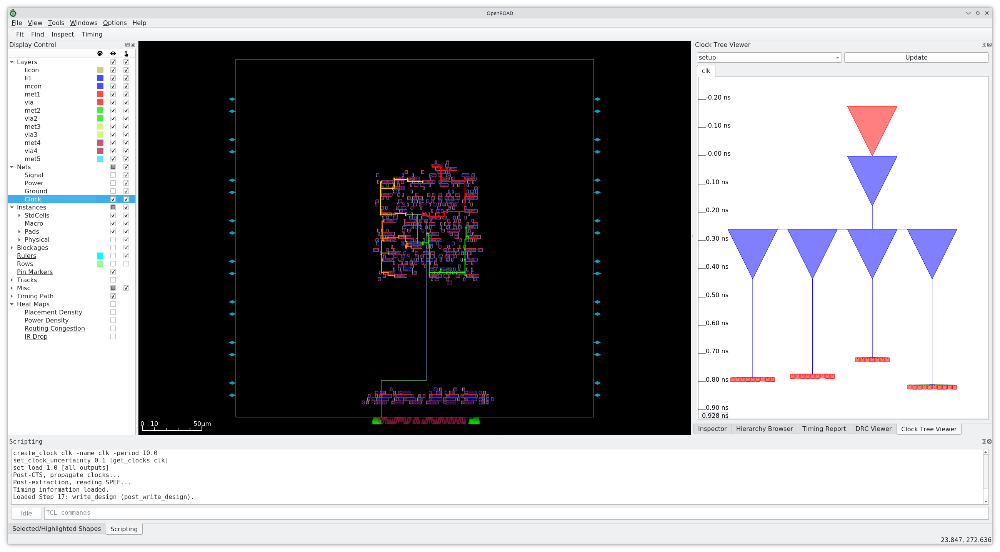
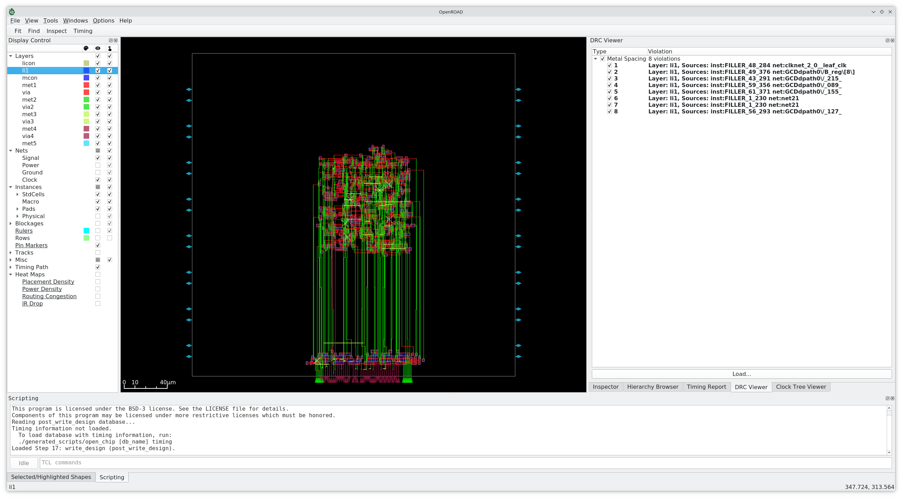

# ASIC Lab 4: Place and Route

## Table of Contents
- [ASIC Lab 4: Place and Route](#asic-lab-4-place-and-route)
    - [Table of Contents](#table-of-contents)
    - [Overview](#overview)
    - [Standard Cell](#standard-cell)
    - [VLSI](#vlsi)
    - [Place and Route Flow](#place-and-route-flow)
        - [Floorplanning](#floorplanning)
        - [Power Planning](#power-planning)
        - [Placement](#placement)
        - [Clock Tree Synthesis (CTS)](#clock-tree-synthesis-cts)
            - [Pre-CTS Optimization](#pre-cts-optimization)
            - [Clock Tree Clustering and Balancing](#clock-tree-clustering-and-balancing)
            - [Post-CTS Optimization](#post-cts-optimization)
        - [Routing](#routing)
        - [Signoff](#signoff)
    - [OpenROAD](#openroad)
    - [Place and Route with Hammer](#place-and-route-with-hammer)
        - [Placement Constraints](#placement-constraints)
        - [Power Constraints](#power-constraints)
    - [Place and Route with OpenROAD](#place-and-route-with-openroad)
        - [Visualizing the Results](#visualizing-the-results)
        - [Step-by-Step with OpenROAD](#step-by-step-with-openroad)
    - [GCD Accelerator](#gcd-accelerator)
        - [FIFO](#fifo)
        - [Design](#design)
        - [Parallelization for Performance](#parallelization-for-performance)
    - [Questions](#questions)
        - [Question 1: Interpreting GCD PAR Reports](#question-1-interpreting-gcd-par-reports)
        - [Question 2: Understanding PAR Steps](#question-2-understanding-par-steps)
        - [Question 3: GCD Coprocessor Design](#question-3-gcd-coprocessor-design)
        - [Question 4: Parallelization](#question-4-parallelization)
        - [Question 5: Parametrization](#question-5-parametrization)
        - [Question 6: Optional PAR](#question-6-optional-par)


## Overview

**Setup:**
In case you haven't done the main lab [Setup](../README.md#setup) successfully, please do so before you continue in order to be able to follow this lab and submit your results. Also, please remember to regularly update (sync) your lab repo with the latest upstream changes, as well as the *digel* repo (with submodules!) in order to include the latest Hammer changes.

Prior to running any commands, you need to activate a Poetry virtual environment with a Hammer (*hammer-vlsi*) installation:

```shell
# Replace <hammer_path> with your Hammer installation path
source <hammer_path>/.venv/bin/activate
hammer-vlsi -h
```

Also, perform some text transformations to prepare the environment for the lab exercise:

```shell
cd lab4
# Replace <hammer_path> with your Hammer installation path
sed -i "s;HAMMER_PATH;<hammer_path>;g" Makefile
sed -i "s;HAMMER_PATH;<hammer_path>;g" cfg/sky130.yml
sed -i "s;~;$HOME;g" cfg/sky130.yml
```

> Note: Before continuing, in order to save time, you can open another terminal window, activate the Poetry environment, and try to run the commands from the first paragraph of [this section](#place-and-route-with-openroad). After `make par` starts making routing iterations, leave it running and then continue reading the lab README.


**Objective:** 
In this lab, you will be introduced to place and route. This stage is digital design following synthesis. It takes the netlist, efficiently places cells, and creates a clock tree and routes or connections between cells to implement your design. This lab consists of several parts:
1. First, we will cover the basic theory of place and route flow and techniques needed for this lab.
2. You will then learn how the tools can create a floorplan, route power straps, place standard cells, perform timing optimizations, generate a clock tree for your design, and route the wires in the design using Hammer and OpenROAD.
3. Afterwards, you will examine the outputs of PAR, that is, OpenROAD reports, including timing, power, and area information. You will analyze and visualize these using OpenROAD GUI.
4. Then, you will be writing a GCD coprocessor that could be included alongside a general-purpose CPU.
5. Next, you will extend the GCD coprocessor design by parallelizing GCD units and parametrizing your parallel GCD coprocessor.
6. Finally, you will run the Hammer place and route flow and examine OpenROAD reports again.

This lab also contains a series of conceptual questions labeled as *thought experiments.* These will not be graded and do not have to be included in your lab deliverables. They are meant to deepen your understanding of the material and serve as discussion points between students.

**Topics Covered**
- Place and Route 
- Metal Layers
- Standard Cell
- CAD Tools (emphasis on *OpenROAD*)
- Hammer
- SKY130 PDK
- Reading Reports
- Power, Performance, Area (PPA)

**Recommended Reading**
- [Verilog Primer](../lab2/doc/Verilog_Primer_Slides.pdf)
- [Ready-Valid Interface](../lab3/doc/ready_valid_interface.pdf)
- [Hammer-Flow](https://hammer-vlsi.readthedocs.io/en/latest/Hammer-Flow/index.html)

The several following sections are meant to provide context that will benefit you in the lab exercise. Please review them (at minimum skim) to gain a better understanding of the what, the why, and the how of physical design for ASICs.

## Standard Cell

A standard cell is a predefined physical layout of transistors for logic gates and storage elements (latches or flip-flops). Standard cells have the same height but may differ in width. The number of transistors and the size of the transistors used determine the size of the standard cell. Each cell comes with timing and power information used during place and route. A cell library is the collection of standard cells used for a process and is part of the PDK. Within the same PDK, there will be multiple cells implementing the same logic gate, but with differently sized transistors. A variety of cells implementing the same logical function with different transistor sizes allows the CAD tool to select which variant to use in order to meet power and timing specifications (larger transistors require more power but can drive larger currents; the trend is opposite for smaller transistors).

<figure align="center">
  
  <figcaption align="center">Layout of NAND gate standard cell.</figcaption>
</figure>


## VLSI

ASICs are 3D structures like a layer cake. At the bottom is the substrate, which is where the transistors lie. Above the substrate are alternating layers of a *metal layer* and a dielectric. The number of layers is process dependent and determined by the foundry. Metal layers are an important concept to understand in ASIC design. Transistors are connected through metal layers. Routes must go through the dielectric up to a metal layer, route through a layer or multiple layers, then back down the substrate to connect transistors. Connections between metal layers are called ***vias***. In addition, power rails are contained in metal layers. Typically, layers higher up contain global routes, and layers closer to the substrate contain local routes. Power distribution is on the higher layers, and routes between two logic gates are on the lower layers.

<figure align="center">
  
  <figcaption align="center">Example metal layer stack-up of a toy ASIC. Please ignore the "Three metal programmable" annotation in the figure. (borrowed from [here](https://www.design-reuse.com/articles/9566/the-platform-based-soc-design-that-utilizes-structured-asic-technology.html) ) </figcaption>
</figure>


## Place and Route Flow

>**Note:** This section is a simple introduction to place and route. Place and route is the most critical stage in the ASIC design flow, and all details cannot be discussed within a single lab.

Place and route actualizes your design or circuit with physical transistors. It is part of "physical design," which is also called PD. Place and route (often written as PAR, P&R, or PnR) follows directly after synthesis in digital design (both ASIC and FPGA). The netlist produced during synthesis expresses the entire design at the gate level with cells from the provided PDK. During PAR, a physical cell instance is created for each cell in the netlist and placed in the chip area. Following placement, routes (or traces) are created to wire the cells together as specified by the netlist.

Intuitively, better placement of the cells implies more efficient routing, which means less area and better timing results. Similarly, the opposite is true; poor placement of cells requires long routes and often fails timing (placement is one of the reasons why synthesis timing reports are not accurate for the final circuit). The output of place and route is a layout.

PAR is the most complex and longest stage in the digital design flow. The details of PAR are beyond the level of this lab; however, it is important to know the general strategy of its algorithms. The design is first partitioned into subdesigns, which exploits parallelism to reduce runtime. The initial placement is iterated upon until the optimal placement is found meeting the design specifications (power, timing, and area) given user constraints. Each CAD tool has its own place and route algorithms; however, they all contain similar stages:

1. *Floorplan*
2. *Power Plan*
3. *Clock Tree Synthesis*
4. *Placement*
5. *Route*
6. *Signoff*


### Floorplanning 

Floorplanning is the process of allocating area for the design, constraining how the area is utilized, and power planning. Floorplanning is often the most important factor for determining a physical circuit's performance, because intelligent floorplanning can assist the tool in minimizing the delays in the design, especially if the total area is highly constrained.

<figure align="center">
  
  <figcaption align="center">Block diagram of floorplan showing die area (full image), IO ring, and core area.</figcaption>
</figure>

The total area designated for the ASIC is called the ***die area***, as it is the total area for a single [die](https://en.wikipedia.org/wiki/Die_(integrated_circuit)). The die area is further subdivided into the IO ring and the core area. The ***IO ring***, sometimes called the IO area, lies between the border of the die area and the core area and is reserved for IO cells. IO cells contain all circuitry required to support IO, including ESD, receiver, driver and IO pads. The remaining area is termed the ***core area***. This is where your design standard cells and macros are placed. The core area is divided into rows of fixed height. Standard cells are placed within these rows. These rows have ***power stripes*** that power to the standard cells and provide structure to the layout of the design.

<figure align="center">
  
  <figcaption align="center">Die area with example rows shown.</figcaption>
</figure>

Floorplan constraints can be "hard" or "soft." "Hard" constraints generally involve pre-placement of "macros," which can be anything from memory elements (SRAM arrays, in an upcoming lab) to analog black boxes (like PLLs or LDOs). "Soft" constraints are generally guided placements of hierarchical modules in the design (e.g., the datapath, controller, and FIFOs) towards certain regions of the floorplan. Generally, the PAR tool does a good job of placing hierarchical modules optimally, but sometimes, a little human assistance is necessary to eke out the last bit of performance.


### Power Planning

Power planning is another major step in floorplanning. ASICs commonly have ***power straps***, routes of different voltages stretched across the core area, carrying power from the power rails. The location and arrangement of the rails can be customized to support the given layout of the circuit. Power planning must be done carefully as it affects the placement of macros and standard cells. Furthermore, individual macros might have power rings or power rails around them that are independent from other logic or macros.


### Placement

Placement is the process of placing the synthesized design (structural connection of standard cells) onto the specified floorplan. While there is placement of minor cells (such as bulk connection cells, antenna-effect prevention cells, IO buffers, filler cells...) that take place separately and in between various stages of design, "placement" usually refers to the initial placement of the standard cells. After the cells are placed, they are not "locked" – they can be moved around by the tool during subsequent optimization steps. However, initial placement tries its best to place the cells optimally, obeying the floorplan constraints and using complex heuristics to minimize the parasitic delay caused by the connecting wires between cells and timing skew between synchronous elements (e.g., flip-flops, memories). Poor placement (as well as poor aspect ratio of the floorplan) can result in congestion of wires later on in the design, which may prevent successful routing.


### Clock Tree Synthesis (CTS)

Clock Tree Synthesis (CTS) is arguably the next most important step in PAR behind floorplanning. Recall that up until this point, we have not talked about the clock that triggers all the sequential logic in our design. This is because the clock signal is assumed to arrive at every sequential element in our design at the same time. The synthesis tool makes this assumption, and so does the initial cell placement algorithm. In reality, the sequential elements have to be placed wherever it makes the most sense (e.g., to minimize delays between them). As a result, there is a different amount of delay to every element from the top-level clock pin that must be *balanced* to maintain the timing results from synthesis. We shall now explore the steps the PAR tool takes to solve this problem and why it is called Clock Tree Synthesis.

#### Pre-CTS Optimization

Pre-CTS optimization is the first round of Static Timing Analysis (STA) and optimization performed on the design. It has a large freedom to move the cells around to optimize your design to meet setup checks and is performed after the initial cell placement. **Hold errors are not checked during pre-CTS optimization**. Because we do not have a clock tree in place yet, we do not know when the clocks will arrive at each sequential element; hence we do not know if there are hold violations. The tool therefore assumes that every sequential element receives the clock ideally at the same time and tries to balance out the delays in data paths to ensure no setup violations occur. In the end, it can generate a timing report, very similar to the ones we saw in the last lab.

#### Clock Tree Clustering and Balancing

Most of CTS is accomplished after initial optimization. The CTS algorithm first clusters groups of sequential elements together, mostly based on their position in the design relative to the top-level clock pin and common [clock gating](https://en.wikipedia.org/wiki/Clock_gating) logic. The number of elements in each cluster is selected so that it does not present too large of a load to a driving cell. These clusters of sequential elements are the **leaves** of the clock tree attached to *branches*.

Next, the CTS algorithm tries to ensure that the delays from the top-level clock pin to the leaves are all the same. It accomplishes this by adding and sizing *clock buffers* between the top-level pin and the leaves. There may be multiple stages of clock buffering, depending on how physically large the design is. Each clock buffer that drives multiple loads is a branching point in the clock tree, and strings of clock buffers in a row are essentially the **trunks**. Finally, the top-level clock pin is considered the **root** of the clock tree.

The CTS algorithm may go through many iterations of clustering and balancing. It will try to minimize the depth of the tree (called *insertion delay*, i.e., the delay from the root to the leaves) while simultaneously minimizing the *skew* (difference in insertion delay) between each leaf in the tree. The deeper the tree, the harder it is to meet both setup and hold timing (*thought experiment #1*: why is this?).

#### Post-CTS Optimization

Post-CTS optimization is then performed, where the clock is now a real signal that is being distributed unequally to different parts of the design. In this step, the tool fixes setup and hold time violations simultaneously. Oftentimes, fixing one error may introduce one or multiple errors (*thought experiment #2*: why is this?), so this process is iterative until it reaches convergence (which may or may not meet your timing constraints!). Fixing these violations involves resizing, adding/deleting, and even moving the logic and clock cells.

After this stage of optimization, the clock tree and clock routing are fixed. Although PAR stages after CTS finalize the rest of the routing, it is usually the case that if your design is unable to meet timing after CTS, there's no point continuing!


### Routing

Routing is the next major flow step, which involves creating the physical connections (wires) between the layout components. Prior to the actual routing step, place and route EDA tools usually use a basic routing engine with errors and shorts but ignore these errors and simply try to get an estimate of delays and parasitics. Once post-CTS optimization is done, it switches to a different tool that actually legalizes routing and tries to eliminate shorts while meeting timing. The routing process must adhere to various design rules and constraints, such as spacing between wires, layer usage, and manufacturing limitations. It is also an iterative process, being repeated until an optimal solution is found. Routing is therefore of the most computationally heavy tasks of digital IC design and can take days to complete for complicated designs. **This will be reflected in the runtime in this lab.**

After routing is complete, a post-route optimization is run to ensure no timing violations remain. Post-route optimization typically has little freedom to move cells around, and it tries to meet the timing constraints mostly by tweaking the length of the routings.


### Signoff

The signoff stage in the PnR flow is the final step before the design is considered complete and ready for manufacturing. It roughly includes:
- Final Verification: This involves thorough checks to ensure that the design meets all specified requirements (performance, power, area, etc.), such as:
   - Timing Verification: Ensuring that the design meets all timing constraints.
   - Design Rule Check (DRC): Verifying that the design adheres to the manufacturing process rules.
   - Layout Versus Schematic (LVS): Ensuring that the layout matches the original schematic (netlist) design.
   - Electromigration (EM) and IR Drop Analysis: Checking for potential reliability issues due to current density and voltage drops.
   - Signal Integrity (SI) Check: Verifying that signal integrity issues such as crosstalk and noise are within acceptable limits.
- Fixing Violations: any remaining violations identified during the final verification are addressed. This could lead to adjusting the placement or routing of components, modifying the clock tree or power distribution network, etc.
- Preparation for Tape-Out: Once all checks are passed and violations are fixed, the design is prepared for tape-out, which includes generating the final GDSII file and sending it to the fab.

The signoff stage is crucial as it ensures that the design is robust, manufacturable, and meets all specified criteria before moving to the fabrication stage.


## OpenROAD

In this course, we use *OpenROAD* to perform place and route by generally following the flow described in previous sections, although some details might differ. OpenROAD does have a GUI; however, like most CAD tools, it is more common to interface with *OpenROAD* using scripts. That said, the best method to verify good placement and visualization of errors is with the GUI. Here we give a quick tutorial to work with the GUI.

You should be able to start the OpenROAD GUI by typing `~/.conda-openroad/bin/openroad -gui`.

In the central part of the GUI, one can see a view that represents the physical layout of individual standard cells, metal layers, power straps, blockages, and more. It provides lots of information about the physical implementation of the design. In this view, useful debugging and inspection can be done.

The *Display Control* pane on the far left (displayed below) allows users to customize the objects displayed in the selected view. Objects have two properties: *visibility* (marked with the "eye" symbol) and *selectability* (marked with the "pointing hand" symbol):
- If the visibility box associated with the object is selected (ticked), then the object is visible; otherwise it is removed from the view.
- If the selectability box associated with the object is selected (ticked), then the object is selectable with the cursor; otherwise it is not.

It is often useful to remove the visibility and selectability of not pertinent objects when trying to investigate a particular issue. It is also useful to engage the visibility, but remove the selectability of objects which are pertinent, but should not interfere while you select objects in the view while debugging.

<figure align="center">
  
</figure>

Objects are categorized within the dropdowns, which naturally follow the organization of physical design. Pay attention to the *Layers* category. This lists the different layers of the used technology flavor. The abbreviation is *met* for metal layer and *via* for vias. Engaging and disengaging the visibility and selectability of the layers allows you to investigate individual routes. Another category is *Nets*, which allows you to hide or show different nets by type. This is incredibly useful for analyzing the impact of global routes like clock or power straps. The final category we will discuss is *Heat Maps*, which represent a pretty simple and interesting way to see design "statistics", such as placement density or routing congestion. This will enable you to see how to better distribute the standard cells and/or macros and how to optimize the connections in between.

A set of panes on the right (some of them might need to be enabled under the *Windows* tab) gives you insight into additional design details:
- *Inspector*: lets you see the details of the selected object's attributes.
- *Hierarchy Browser*: displays a hierarchical list of instances with their main features.
- *Timing Report*: displays a graphical view of the timing reports with timing path details.
- *Clock Tree Viewer*: depicts how the clock tree looks "in time."
- *DRC Viewer*: shows the list of DRC errors loaded from the post-layout DRC report.

In the bottom part of the GUI, there is a *Scripting* subwindow where the output log and messages are printed. This pane also enables you to manually enter custom TCL commands or further analyze and test the design using commands.

The *OpenROAD* GUI offers many more tools that aid in physical design, including zooming, selecting regions and paths, highlighting, rulers, manipulating routes, and more. If interested, please look at the *OpenROAD* [User Guide](https://openroad-test.readthedocs.io/en/latest/user/UserGuide.html) for more info, as this lab cannot introduce all the details. In future, feel free to try out some keyboard shortcuts (*Z, Shift+Z, F, Ctrl+F, K*) and arbitrary "right-clicks" on GUI objects and figure out what they do.


## Place and Route with Hammer

*OpenROAD* is a powerful tool, but the learning curve is steep; therefore, in this class, we primarily use the GUI for visualization and interact with the tool through scripting. The flow used in this course is generated by Hammer that abstracts a lot of the cumbersome lower-level detail away, but there are principal steps of the flow that one should know:

|   OpenROAD flow step  | Description                                                                                                                                              |
|:---------------------:|----------------------------------------------------------------------------------------------------------------------------------------------------------|
|     _init_design_     | Reads in all necessary technology files (Liberty, LEF, etc.) and design source files (netlist, constraints, etc.) and configures the flow setup.         |
|  _floorplan_design_   | Creates the floorplan; specifies the die and IO area and utilization.                                                                                    |
|     _place_bumps_     | Creates bumps for design; bumps are locations for IO to be routed to (modern IC design does not have pins for IO, but bumps).                            |
|   _macro_placement_   | Places macros (RAMs, embedded macros, etc.).                                                                                                             |
|   _place_tapcells_    | Inserts tap cells and well ties.                                                                                                                         |
|    _power_straps_     | Creates power distribution network (PDN).                                                                                                                |
|  _global_placement_   | Places standard cells and performs optimization and repair for max slew, max capacitance, and max fanout violations and long wires.                      |
|    _io_placement_     | IO pin placement (for designs without pads).                                                                                                             |
| _detailed_placement_  | Legalizes placement - aligns cells to grid, adheres to design rules. Includes incremental timing analysis for early estimates.                           |
|     _clock_tree_      | Creates a clock tree and performs optimizations of the clock tree to meet timing constraints. Inserts buffers and resizes objects for high fanout nets.  |
|     _add_fillers_     | Adds filler cells to the design; filler cells occupy spaces in the die area where standard cells are absent to provide structural integrity to the chip. |
|    _global_route_     | Creates routing guides. Repairs process antenna violations.                                                                                              |
|   _detailed_route_    | Legalizes routes; DRC-correct routing to meet timing; power constraints.                                                                                 |
|     _extraction_      | Generates design parasitics (resistance, capacitance) information and a [SPEF](https://en.wikipedia.org/wiki/Standard_Parasitic_Exchange_Format) file.   |
|    _write_design_     | Writes out a final design database that includes a netlist, GDS file, SDF file, etc.                                                                     |


### Placement Constraints

In this lab, we will provide basic placement constraints specified in the *cfg/design.yml* file. Open up this file and locate the following text block:

```yaml
# Placement Constraints
vlsi.inputs.placement_constraints:
  - path: "gcd"
    type: "toplevel"
    x: 0
    y: 0
    width: 300
    height: 300
    margins:
      left: 10
      right: 10
      top: 10
      bottom: 10
# - path: "gcd/GCDdpath0"
#   type: "placement"
#   x: 100
#   y: 100
#   width: 100
#   height: 100

# Pin placement constraints
vlsi.inputs.pin_mode: generated
vlsi.inputs.pin.generate_mode: semi_auto
vlsi.inputs.pin.assignments: [
  {pins: "*", layers: ["met2", "met4"], side: "bottom"}
]
```

The `vlsi.inputs.placement_constraints` block specifies two floorplan/placement constraints. The first one denotes the origin `(x, y)`, size `(width, height)`, and border margins of the top-level block `gcd`. The commented second one denotes a soft placement constraint on the GCD datapath to be roughly in the center of the floorplan (for complicated designs, floorplans of major modules are often defined separately and then assembled together hierarchically). Pin constraints are also shown here. The only thing to recognize is that all pins are constrained at the bottom boundary of the design, on layers metal 2 and metal 4. Pin placement becomes very important in a hierarchical design, if modules need to abut each other.


### Power Constraints

Power must be delivered to the cells from the topmost metal layers all the way down to the transistors in a fashion that minimizes the overall resistance of the power wires without eating up all the resources that are needed for wiring the cells together. There are different ways to implement the power distribution, but the preferred method is to place interconnected grids of wide wires on every metal layer. There are tools to analyze the quality of the power distribution network, which calculate how the current being drawn by the circuit is transiently distributed across the power grid.

In the middle of the `cfg/sky130.yml` file, you will see this block, which contains parameters to Hammer's power strap auto-calculation API:

```yaml
# Power Straps
par.power_straps_mode: generate
par.generate_power_straps_method: by_tracks
par.blockage_spacing: 2.0
par.blockage_spacing_top_layer: met3
par.generate_power_straps_options:
  by_tracks:
    strap_layers:
      - met2
      - met3
      - met4
      - met5
    blockage_spacing_met2: 4.0
    track_width: 6
    track_width_met5: 2
    track_spacing: 1
    track_start: 10
    track_start_met5: 1
    power_utilization: 0.2
    power_utilization_met2: 0.05
    power_utilization_met5: 0.5
```

You should not need to touch this block of YAML, because the parameters are tuned for meeting design rules in this technology. However, the important parameter is `power_utilization`, which specifies that approximately 20% of the available routing space on each metal layer should be reserved for power, with the exception of metals 2 and 5, which have 5% and 50% density, respectively.


## Place and Route with OpenROAD

Let's set up the prerequisites for PAR and run PAR:

```shell
make syn
make timing-syn
make syn-to-par
#make par # see the Note below
make redo-par HAMMER_EXTRA_ARGS="--stop_after_step extraction"
make redo-par HAMMER_EXTRA_ARGS="--start_before_step extraction"
```

> Note: OpenROAD sometimes freezes on commands following the *detailed_route* step (say, "report_check_types"), so for now we recommend running place and route until the *extraction* step, then restarting the flow at this step. See Hammer [flow control](https://hammer-vlsi.readthedocs.io/en/latest/Hammer-Use/Flow-Control.html) for more info.

The third command here translates the outputs of the synthesis tool to conform to the inputs expected by the PAR tool. The fourth command is similar to the partial synthesis commands we used in the last lab. Hammer will wait until *OpenROAD* is done with the PAR steps through parasitics extraction and then end PAR.

The PAR command could take a long time to complete, as it runs through practically all stages of PAR. Check out the iterations that OpenROAD runs through during optimization. You can see some of the metrics that OpenROAD is using. Once it completes, let's take a look into the *build/par-rundir* folder and the most important outputs from PAR:
- *par.tcl*: Hammer generated this file for *OpenROAD* to consume in batch mode, and inside are OpenROAD commands as a TCL script (type `~/.conda-openroad/bin/openroad -help` to see how).
- *reports*: the directory containing the timing reports. You should be familiar with these since they are pretty similar to the `timing-syn` reports from lab 3.
- *gcd.gds*: the most important PAR output is the [GDS](https://en.wikipedia.org/wiki/GDSII) file, which defines the geometric shapes, text labels, and other information about the layout. When the chip design is finished, **the GDS file** is sent to [foundry](https://en.wikipedia.org/wiki/Semiconductor_fabrication_plant) for chip fabrication.
- *gcd.sim.v*: the post-layout netlist, which represents the schematic of the design and which can be used for gate-level simulation. You can also notice the *gcd.lvs.v*, which is used for the LVS check.
- *gcd.par.sdf.gz*: the compressed SDF file that should be annotated during gate-level simulation.
- *openroad.log*: the main log file of the entire OpenROAD place and route execution.

*(thought experiment #3: Open the "par.tcl" and search for the command "filler_placement." Based on the names of the cells specified by this command, what do you think is the function of the filler cells?)*

You might see many additional files compared to the `syn-rundir`, and that’s because the PAR flow incorporates the RC and parasitic delays, in addition to the cell delays (remember SPEF?). Open `build/par-rundir/gcd.par.spef` and search for the first occurrence of `D_NET`. What does it say about the first net? You may find [this page](https://en.wikipedia.org/wiki/Standard_Parasitic_Exchange_Format#Parasitics) helpful.
*(thought experiment #4: get a sense of the units at the top and orders of magnitude of the RC parasitics in the SPEF file. If we used a different technology library with a finer process (e.g., 65 nm), do you expect the resistance to generally increase or decrease? How about the capacitance?)*

After you are done with PAR, it is time to simulate the post-PAR netlist. Type the following command:

```
make sim-gl-par
```

This will use the same testbench but will now use the post-PAR netlist of your design, backannotated with delays and parasitics from PAR (from the SDF file). Note, however, that you may need to slightly relax the `CLOCK_PERIOD` variable in `cfg/sim-gl-par.yml`.


### Visualizing the Results

From the `build/par-rundir` folder, execute the following:

```shell
./generated-scripts/open_chip --timing
```

The OpenROAD GUI should pop up with your layout, and the *OpenROAD* shell runs in your terminal. You should see your entire design, which should look roughly similar to the one below. Take a moment to familiarize yourself with the OpenROAD GUI, and then let's dive into the details.

<p align="center">
  
</p>

First, let's see how the tool placed the standard cells. Untick all "Nets" and "Instances" and select "Placement Density" under "Heat Maps". We can see that most of the cells are placed in the central part of the layout. The rest of the design is placed near the IO pins.
<!-- , which is due to our soft placement constraint on the GCD datapath module.  -->

<p align="center">
  
</p>

Now, let's take a look at the clock tree. In the left panel, under the "Nets" category, hide from view all the types of nets except "Clock." In the Clock Tree Viewer, click "Update" to load in the clock tree graph. Your GUI should now look approximately like this, which shows the clock tree routing:

<p align="center">
  
</p>

The red squares are the leaves, the blue triangles are the clock buffers, and the red triangle on top is the clock pin or the clock root. The numbers on the left side denote the insertion delay in ps.

Next, let's see how the tool performed the routing. Untick all "Nets" and "Instances" and select "Routing Congestion" under "Heat Maps". We can see that the routing practically follows cell placement and pin positions. The contribution from the power straps in different metal layers is also very noticeable.

<p align="center">
  
</p>

Now, let's visualize the timing paths. Go to the Timing Report pane and click "Update" to load in the STA timing report OpenROAD generated. The first path on the top of the upper table is the critical path. By selecting it and clicking each segment, each subpath can be highlighted in the layout view.

<p align="center">
  
</p>

Finally, let's see if there are any DRC errors in our design. Open the DRC Viewer and "Load" in the `reports/gcd_route_drc.rpt` report. The white "Xs" mark the locations of DRC errors. These should always be fixed before the final GDS is sent for fabrication.

<p align="center">
  
</p>

When you are done playing around, you may exit OpenROAD by closing the GUI window.


### Step-by-Step with OpenROAD

As an **optional** exercise, step through the *OpenROAD* place and route flow using the commands from *par.tcl*. While entering the commands, you will see *OpenROAD* print out information about the progress of each step. Make sure you are in the directory *build/par-rundir* and type:

```shell
~/.conda-openroad/bin/openroad -gui
```

This should open the OpenROAD GUI. Now, follow *par.tcl* command by command, copying and pasting the commands to the OpenROAD shell and looking at the GUI for any changes. You may skip the `puts` commands, as they just tell the tool to print out what it is doing, and the `write_db` commands, which write a checkpoint database between each step of the PAR flow. The steps after which you will see significant changes are listed below:

As you progress through the steps, feel free to zoom in to investigate what is going on with the design, look at the extra TCL files that are sourced, and cross-reference the commands by typing `help <command_name>` in the OpenROAD shell. There is also a possibility to [install](https://openroad.readthedocs.io/en/latest/main/src/utl/README.html#man-installation) the `man` pages command, but we will not do that in this course.


## GCD Accelerator

In this part of the lab, you will be writing a GCD coprocessor that could be included alongside a general-purpose CPU. We will build upon the GCD module from lab 3 by adding FIFOs. As a reminder, the GCD module computes the greatest common denominator between two inputs. Your module will act as an accelerator that accepts inputs from a processor and returns the result.


### FIFO

A first-in, first-out (FIFO) queue is a common data structure in both hardware and software. The purpose of a FIFO is to buffer, or hold, incoming data until that data is requested. Once requested, data will exit the FIFO. There are many implementations of FIFO, but they all follow a single strict ordering rule: *any particular entry must exit the FIFO prior to any entries that entered after it.* For this reason, a FIFO is often compared to a queue, or a line formed at entrances (e.g., a line to enter a concert or a line formed in a school cafeteria for lunch). FIFOs are frequently utilized in digital design at module interfaces.

<figure align="center">
  
  <figcaption align="center">Block diagram of a FIFO (borrowed from [here](http://tinyurl.com/2becpjhk) ).</figcaption>
</figure>

Conceptually, there are two sides to a FIFO: (1) one side receives incoming data, and (2) the other side outputs outgoing data. Each "side" is a separate interface, often a simple, ready-valid interface. The FIFO *width* describes the bit width of the data it contains. The FIFO *depth* describes the number of entries the FIFO can hold.

It is critical to understand that a FIFO is constructed from some form of memory. FIFOs are composed of either registers or SRAM. Although functionality is the same regardless of the underlying memory, the cost of implementation in ASIC design is different, especially for wide and/or deep FIFOs. In ASIC design, registers are considered to be more expensive as they are not as compact as SRAM. Therefore, large FIFOs are preferably SRAM-based. On the other hand, SRAMs are not readily available and usually require the usage of (and a license for) an SRAM generator.


### Design

Below is a simple block diagram of the GCD accelerator design:

<p align="center">
  
</p>

As a reminder, a FIFO is a sequential logic element that accepts (enqueues) valid data and outputs (dequeues) it in the same order when the next block is ready to accept. This is useful for buffering between the producer of data and its consumer.
A partially written FIFO has been provided for you in `src/fifo.v`. For this specific implementation, when the input data is valid (`enq_val`) and the FIFO is ready for data (`enq_rdy`), the input data is enqueued into the FIFO. There are similar signals for the output data. This interface is called a "decoupled" interface, and if implemented correctly, it makes modular design easy (although sometimes with performance penalties).

Below is a specification for the expected FIFO implementation:
- This FIFO is implemented with a 2-dimensional array of data called `buffer`. 
- There are two pointers: a read pointer `rptr` and a write pointer `wptr`. 
- When data is enqueued, the write pointer is incremented. 
- When data is dequeued, the read pointer is incremented. 
- The FIFO depth is always a power of 2 (`LOGDEPTH` parameter).
- We can leverage the fact that addition rolls over and the FIFO will continue to work.
- If the read and write pointers are the same, we don't know if the FIFO is full or empty. The `full` register clears this ambiguity. When the pointers are the same and we just enqueued, the `full` register is set to 1 and set to 0 otherwise.

Please complete the FIFO implementation so that it behaves as expected.

Template code for the GCD coprocessor has been provided in the `src` directory. Below are the reproduced contents of `gcd_coprocessor.v`:

```verilog
module gcd_coprocessor #( parameter W = 32 )(
  input clk,
  input reset,
  input operands_val,
  input [W-1:0] operands_bits_A,
  input [W-1:0] operands_bits_B,
  output operands_rdy,
  output result_val,
  output [W-1:0] result_bits,
  input result_rdy
);

  // You should be able to build this with only structural verilog!

  // TODO: Define wires

  // TODO: Instantiate gcd_datapath

  // TODO: Instantiate gcd_control

  // TODO: Instantiate request FIFO

  // TODO: Instantiate response FIFO

endmodule
```

This module is parameterized. `W` is the data width of your coprocessor; the input data and output data will all be this bit width. Be sure to pass this parameter on to any submodules that may use it! You should implement a coprocessor that can handle 4 outstanding requests at a time. For now, you will use FIFOs to store requests and responses.

Complete the coprocessor implementation in `src/gcd_coprocessor.v`, so that the GCD unit and FIFOs are connected like in the diagram above. Note the connection between the `gcd_datapath` and `gcd_control` should be very similar to that in lab 3's GCD and that clock and reset are omitted from the diagram. You will need to think about how to manage a ready/valid decoupled interface with 2 FIFOs in parallel.

A testbench has been provided for you (`src/gcd_coprocessor_testbench.v`). You can run the testbench to test your code by typing `make sim-rtl` as before.


### Parallelization for Performance

One way we can improve the performance of our GCD coprocessor is by parallelizing the compute. We can do this by including multiple GCD units in our design and routing traffic to them as they become available.

For this purpose, the testbench has been modified (`src/gcd_coprocessor_parallel_testbench.v`) to check the total number of cycles taken by the coprocessor to complete the tests. Run `make sim-rtl` to with the new testbench on the solution code. Take note of the number of cycles that the tests take without modification, as you will need it to calculate your speedup.

Your task is to edit `src/gcd_coprocessor.v` and create `src/gcd_coprocessor_parallel.v` to improve the performance <u>below 225 cycles</u>. We will do this by using two instances of GCD. If your design does not meet this target, consider optimizing your FIFO or your arbiter to make them more efficient.

You will find RTL that connects the datapath and controller into one module in `src/gcd_unit.v`. You may find this useful when refactoring the `gcd_coprocessor`, since you will need fewer wires to place both GCD instances.

You will also find stub code for an arbiter in `src/gcd_arbiter.v`, which you should complete. We will use the arbiter to route traffic to GCD units and preserve the response ordering. Most of your design can be implemented with combinational logic, but you will need some state to remember which GCD block contains the earliest data to preserve ordering.


## Questions

Solutions for lab questions should be submitted electronically using **GitHub**. Submit your answers to the following questions by writing the corresponding answers to `ans/Q*/Q*.md` (use the `ans/Q*/` directory for additional files) files and performing a `git commit` and  `git push`. Feel free to use [Markdown](https://www.markdownguide.org/cheat-sheet/) for formatting. When you finish with the lab exercise, please `git tag` your last commit with the tag name *lab4* in order to mark the deliverable. **Otherwise, the last commit before the lab due date will be chosen as the deliverable.**

Also, remember to include a short explanation of each answer (2-4 sentences) with your responses to the lab questions. When asked to write Verilog, include the module definition. There is no single solution, so individual solutions will vary. **Collaboration is fine, but your solution should be your own.**


### Question 1: Interpreting GCD PAR Reports

1. What is the critical hold timing path and slack of your design:
  - after synthesis? (trick question)
  - after CTS?
  - after routing?
  Copy the and mark each relevant timing report to `ans/Q1`.

2. Look in the post-layout text timing report (`build/par-rundir/reports/rcx_sta.checks.max.setup.rpt`). Find a path inside which the same type of cell is used more than once. Identify the delay of those instances of that common cell. Can you explain why they are different?

3. Which post-layout report contains the <u>worst case</u> power consumption and **why**? What is the total power consumption value?


### Question 2: Understanding PAR

1. Take a note of the orientations of power straps and routing metals. If you were to place pins on the right side of this block instead of the bottom, what metal layers should they be on?

2. Name at least 5 different DRC check types that need to be checked before a design is sent for tape-out.

3. Name at least 3 power consumption optimization techniques and describe each of them using 1 sentence.

4. If a chip is already manufactured and during testing you notice setup timing violations, what can you do/change to "resolve" them (while inevitably affecting PPA)? Can you do the same for hold violations?

Thought Experiments (UNGRADED):
<ol type="a">
  <li> Why is it harder to meet both setup and hold timing constraints if the clock tree has a large insertion delay? </li>
  <li> Why does fixing one setup or hold error introduce one or multiple errors? Is it more likely to produce an error of the same or different type, and why? </li>
</ol>


### Question 3: GCD Coprocessor Design

1. Commit your code (`gcd_coprocessor.v` and `fifo.v`) to `ans/Q3/src` and the corresponding YAML files to `ans/Q3/cfg` and show that your code works (Questa Sim waveforms and transcript are fine).


### Question 4: Parallelization

1. Submit your code (`gcd_coprocessor_parallel.v` and `gcd_arbiter.v`) to `ans/Q4/src` and the corresponding YAML files to `ans/Q4/cfg`.

2. How many cycles did your simulation take? What was the % speedup?

3. Run synthesis and post-synthesis STA. What is the area consumed by your design? What percentage of the total area does the arbiter occupy? Commit the reports to `ans/Q4/rpt`.

4. What is the difference between WNS (worst negative slack, which is actually positive when timing is met) for `gcd_coprocessor` and WNS for `gcd_coprocessor_parallel`. Support your answer with timing reports commited to `ans/Q4/rpt`..


### Question 5: Parametrization

1. Modify your `gcd_coprocessor_parallel.v` to take an input parameter in terms of the number of clock cycles we want our design to meet (`parameter TARGET_NUMBER_OF_CYCLES`) for this given testbench. Your code should generate a low-area, low-power design if the target number is greater than that your simple GCD coprocessor can achieve, and it should generate the dual-unit design if it is lower. **Submit your code.** *Hint*: Use the Verilog `generate` syntax for choosing between designs. See [here](https://www.chipverify.com/verilog/verilog-generate-block) for documentation on how to use the `generate` syntax.

2. Run synthesis and post-synthesis STA for `TARGET_NUMBER_OF_CYCLES` values of 225 and 200. Commit the reports to `ans/Q5/rpt`. What is the difference in PPA between these two designs and your original `gcd_coprocessor_parallel` from Question 4?

3. (Optional) Using a rough estimate of the target number of cycles versus the number of units in the design, write a code that will generate 1-8 cores depending on the performance demand. Do NOT do this by writing out every possible case explicitly. You can limit the number of units to powers of two (1, 2, 4, 8) if it makes your life easier.


### Question 6: Optional PAR

This question is optional, and it can be done to earn bonus points.
Run the entire ASIC design flow (RTL simulation, synthesis + STA, place and route, gate-level simulation) for your new designs: `gcd_processor` from Question 3 and `gcd_processor_parallel` from Question 4 or 5.
Update the `TOP` variable in the Makefile accordingly. Try to achieve no timing violations and a total number of DRCs less than 20. Beware: the routing runtime can be significantly long!

Commit all relevant source files (`src/*`, `cfg/*`, Makefile) to `ans/Q6/`. Also, commit your entire build directories to the `ans/Q6/build` directory.
